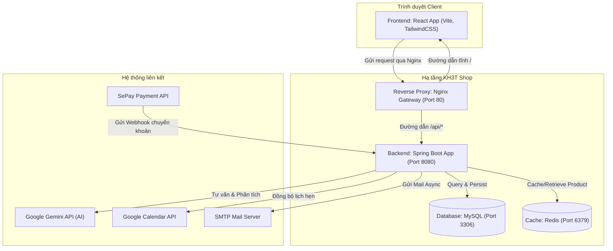
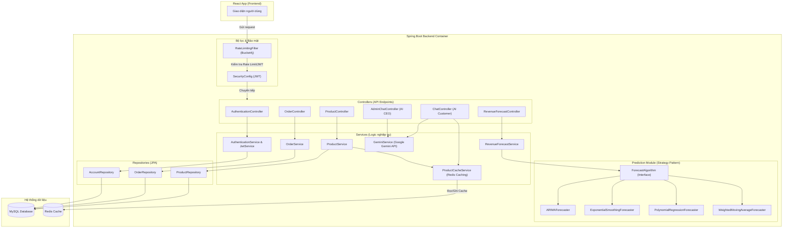

# BÁO CÁO KIẾN TRÚC PHẦN MỀM - HỆ THỐNG KH3T SHOP
## Trường Đại học Công nghiệp Thành phố Hồ Chí Minh (IUH)
### Nhóm thực hiện: KH3T
*   **Thành viên 1**: Dương Thế Khánh
*   **Thành viên 2**: Phạm Văn Hinh
*   **Thành viên 3**: Phạm Ngọc Thành

---

# 1. Tổng quan hệ thống KH3T Shop
*   **Hệ thống**: Nền tảng thương mại điện tử chuyên biệt cho ngành thời trang.
*   **Đối tượng phục vụ**: 
    *   *Khách hàng*: Tìm kiếm sản phẩm, mua sắm và nhận tư vấn thời trang thông minh.
    *   *Admin (Chủ shop)*: Quản lý hàng hóa, đơn hàng và xem báo cáo tài chính/dự báo bán hàng.
*   **Mục tiêu kiến trúc**: Đảm bảo hiệu năng ổn định, bảo mật cao, khả năng mở rộng tốt và tích hợp các module trí tuệ nhân tạo hiện đại.

---

# 2. Các chức năng chính đã triển khai
*   **Thanh toán tự động (SePay Webhook)**: Tự động phát hiện biến động số dư tài khoản ngân hàng để xác thực và cập nhật trạng thái đơn hàng tức thời.
*   **Trợ lý ảo mua sắm (Gemini AI)**: Tích hợp mô hình Gemini 2.5 Flash để tư vấn size, phối đồ, và so sánh các sản phẩm thời trang.
*   **Trợ lý CEO ảo**: Cung cấp báo cáo tài chính real-time và gợi ý chiến lược kinh doanh cho chủ shop qua giao diện chat.
*   **Công cụ dự báo doanh số**: Dự báo doanh thu cửa hàng dựa trên các thuật toán học máy thống kê.
*   **Đồng bộ Lịch & Email**: Kết nối Google Calendar và gửi email hóa đơn tự động bằng cơ chế bất đồng bộ (Async).

---

# 3. Sơ đồ kiến trúc C1 - System Context
*   **Actor**: Khách hàng, Admin/Chủ shop.
*   **Hệ thống chính**: KH3T Shop (Web & API).
*   **Hệ thống liên kết ngoài**:
    *   *Google Gemini API* (Tư vấn thời trang & Phân tích).
    *   *Google Calendar API* (Đồng bộ lịch biểu).
    *   *SMTP Mail Server* (Gửi hóa đơn tự động).
    *   *SePay API* (Webhook giao dịch chuyển khoản).

```mermaid
graph TD
    User["Khách hàng & Admin"] -->|Sử dụng hệ thống| System["Hệ thống KH3T Shop (Web và API)"]
    System -->|Đồng bộ lịch hẹn| GoogleCalendar["Google Calendar API"]
    System -->|Tư vấn & Phân tích| Gemini["Google Gemini API (AI)"]
    System -->|Gửi Email (Async)| MailServer["SMTP Mail Server"]
    SePay["SePay Webhook"] -->|Xác nhận chuyển khoản| System
```

---

# 4. Sơ đồ kiến trúc C2 - Containers & Công nghệ
*   **Kiến trúc**: Decoupled (FE/BE chạy độc lập) phối hợp với API Gateway.
*   **Frontend**: React (Vite, TailwindCSS v4) xử lý giao diện người dùng.
*   **API Gateway**: Nginx Proxy (Port 80) điều hướng luồng request.
*   **Backend**: Spring Boot (Java 21, Port 8080) quản lý logic nghiệp vụ.
*   **Cache Server**: Redis (Port 6379) tối ưu tốc độ đọc sản phẩm.
*   **Database**: MySQL (Port 3306) lưu trữ dữ liệu vĩnh viễn.



---

# 5. Sơ đồ kiến trúc C3 - Components Backend
*   **Bộ lọc**: `RateLimitingFilter` (chống DDOS/Brute-force) và `SecurityConfig` (quản lý token JWT).
*   **Controllers**: Tiếp nhận các endpoint API xử lý yêu cầu client.
*   **Services**: Thực hiện logic nghiệp vụ chính (`GeminiService`, `ProductCacheService`...).
*   **Prediction Module**: Phân rã nghiệp vụ dự báo doanh thu áp dụng **Strategy Pattern**.
*   **Repositories**: Các Spring Data JPA thực hiện thao tác lưu/đọc dữ liệu từ MySQL.



---

# 6. Ứng dụng AI & Thuật toán dự báo
*   **Generative AI (Gemini 2.5 Flash)**:
    *   Tự động phân tích sản phẩm (giá, discount, rating, chất liệu, size còn lại) và lịch sử chat để tư vấn cá nhân hóa.
    *   Tự động lọc và nhận diện ý định so sánh sản phẩm của khách hàng (Compare Intent) để trả về so sánh trực quan.
*   **Strategy Pattern trong dự báo**:
    *   Hệ thống có thể linh hoạt hoán đổi thuật toán dự báo doanh thu tại thời điểm chạy (runtime):
    *   *Các thuật toán*: ARIMA, Exponential Smoothing, Polynomial Regression, Weighted Moving Average.

---

# 7. Đặc tính hiệu năng & Bảo mật
*   **Redis Caching**: Giảm tải hơn 90% truy cập cơ sở dữ liệu MySQL, nâng tốc độ phản hồi danh sách sản phẩm phục vụ AI chatbot.
*   **Xử lý bất đồng bộ (@Async)**: Sử dụng thread pool riêng để gửi email hóa đơn và cập nhật lịch hẹn nhằm giải phóng luồng xử lý của khách hàng tức thời.
*   **Rate Limiting**: Sử dụng thuật toán Token Bucket (Bucket4j) giới hạn tối đa 5 requests đăng nhập/phút trên mỗi IP để ngăn chặn dò mật khẩu.

---

# 8. Quy trình DevOps & CI/CD
*   **Dockerization**: Đóng gói cô lập các dịch vụ (mysql, redis, frontend, backend, nginx gateway, jenkins).
*   **CI/CD Pipeline**:
    *   *GitLab CI*: Tự động chạy unit test và build gói JAR.
    *   *Jenkins Pipeline*: Lấy code từ repo, build frontend, package Docker images, và tự động deploy lên staging server.
*   **Terraform**: Định nghĩa cơ sở hạ tầng dưới dạng code (IaC) để cấu hình và triển khai Nginx container nhanh chóng.

---

# 9. Các câu hỏi phản biện kiến trúc quan trọng (Q&A)
*   **Tại sao chọn kiến trúc Monolith thay vì Microservices?**
    *   *Trả lời*: Phù hợp với quy mô cửa hàng vừa và nhỏ, dễ dàng phát triển và kiểm thử nhanh, triển khai đơn giản bằng docker-compose, tránh các lỗi liên quan đến giao dịch phân tán và độ trễ mạng mạng.
*   **Tại sao chọn Redis cho chức năng cache sản phẩm?**
    *   *Trả lời*: Tần suất đọc thông tin sản phẩm cực kỳ cao so với tần suất ghi mới. Chatbot AI cần context sản phẩm thời gian thực, việc truy vấn Redis (< vài ms) thay vì MySQL giúp nâng cao đáng kể trải nghiệm chat của khách hàng.
*   **Tại sao chưa dùng CQRS/Event Sourcing?**
    *   *Trả lời*: Hệ thống chủ yếu thực hiện các tác vụ CRUD thông thường, việc áp dụng CQRS/Event Sourcing sẽ làm tăng độ phức tạp kiến trúc và chi phí vận hành mà không mang lại lợi ích rõ rệt ở thời điểm hiện tại.
